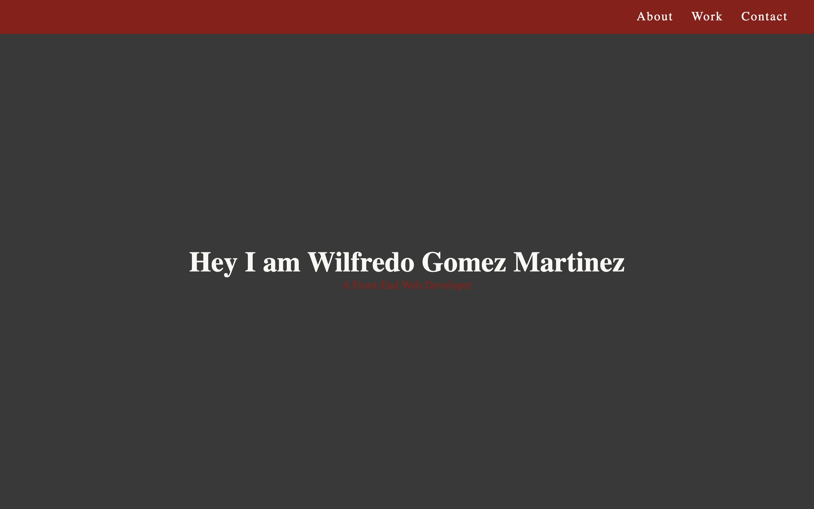

# Portfolio

The layout for future **The Page Guy** Front-End Web Developer Portfolio

## Screenshots

## Demo

Link

## Author

- [@thepageguy](https://www.github.com/thepageguy)

## Acknowledgement

- [FreeCodeCamp](https://www.freecodecamp.org/)

## Tech Stack

**Languages:** HTML5 and CSS3

## Features

- Responsive

## Lessons Learned

- Combime different CSS properties
- Layouts for Web Portfolio

## Feedback

If you have any feedback, please reach out at thepageguy@mailfence.com.
